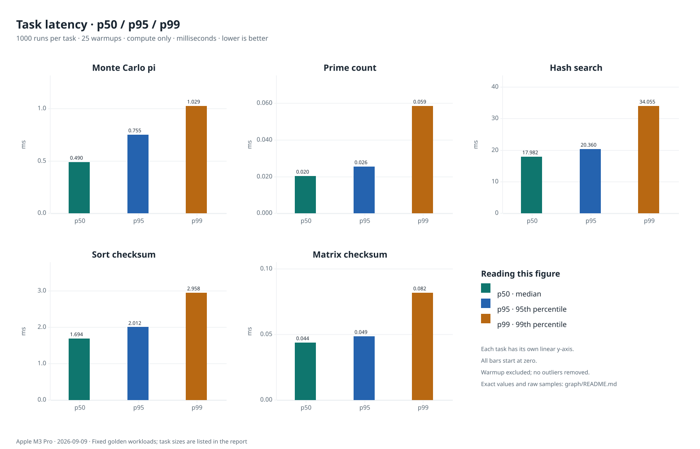
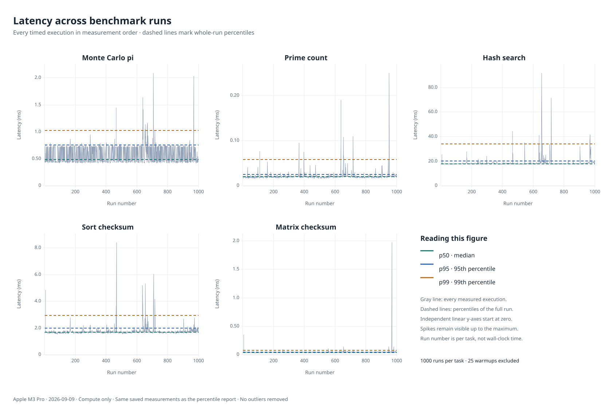
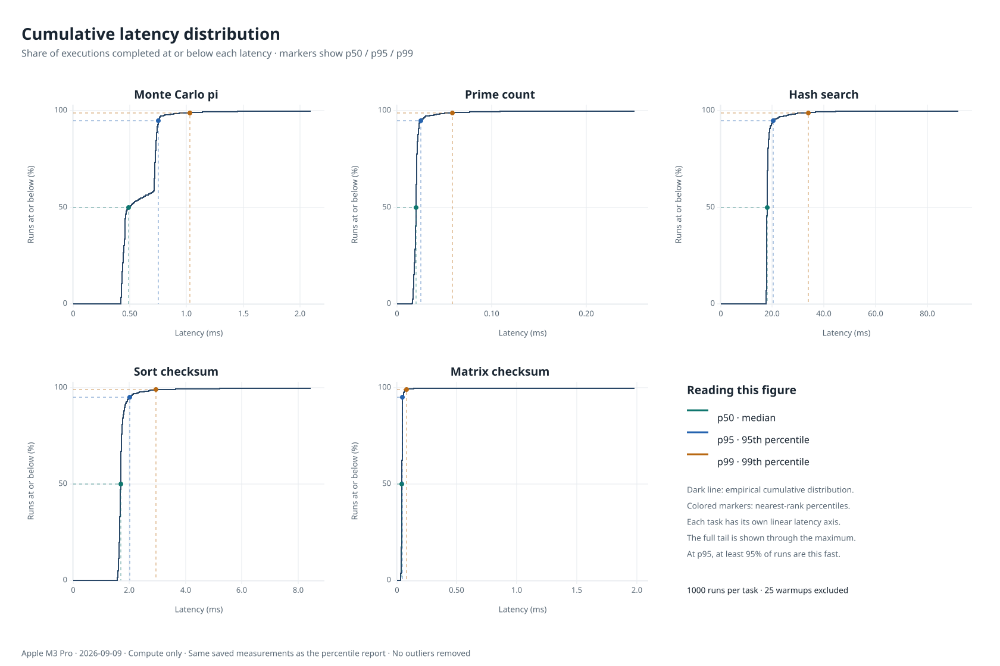
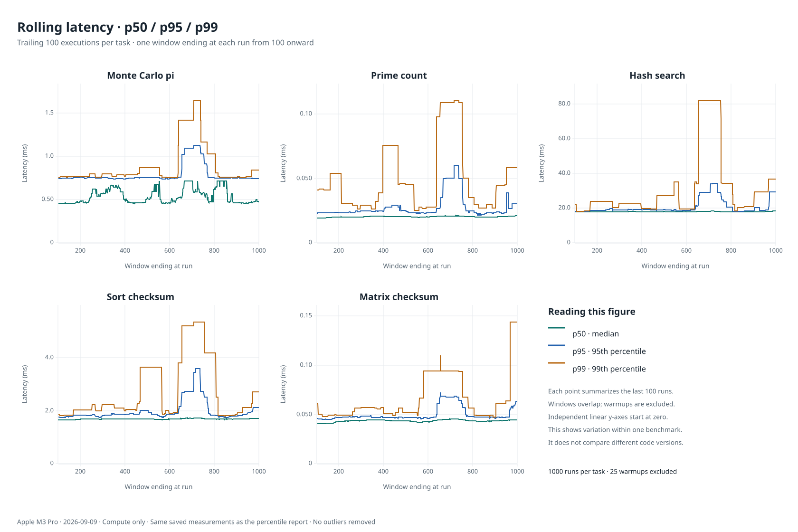
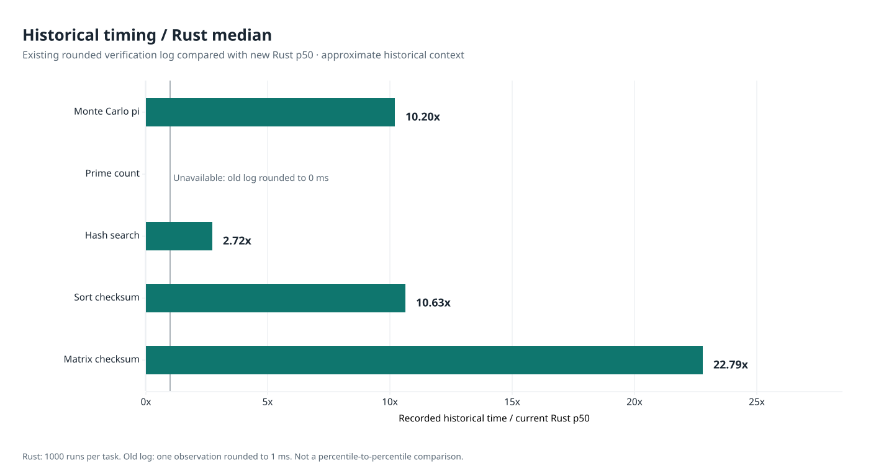

# Rust task latency

Measured **1000 Rust executions per task** after **25 warmups per task**, using
the five fixed golden workloads. Benchmarking, statistics, and graph generation
run as a native Rust application. Every result was checked against its expected
integer answer.



## Measured Rust percentiles

All values are milliseconds. Lower is better. These measure `execute(task)`
inside the Rust process; networking, queue time, process startup, caller-side
task construction, serialization, and answer validation are excluded.

| Task | p50 | p95 | p99 |
|---|---:|---:|---:|
| `monte_carlo_pi` | 0.4903 | 0.7549 | 1.0290 |
| `prime_count` | 0.0204 | 0.0255 | 0.0585 |
| `hash_search` | 17.9824 | 20.3596 | 34.0547 |
| `sort_checksum` | 1.6935 | 2.0116 | 2.9580 |
| `matmul_mod` | 0.0439 | 0.0488 | 0.0821 |

## Latency across runs



Every saved observation appears in measurement order, with whole-run p50, p95,
and p99 shown as dashed reference lines. Run numbers are per task, not elapsed
wall-clock time. Each panel uses its own linear latency axis starting at zero
and includes the slowest observation.

## Cumulative latency distribution



The step curve shows the percentage of executions completed at or below a
given latency. Colored guides mark the nearest-rank p50, p95, and p99. The full
tail remains visible through the maximum, with a separate latency axis for
each task.

## Rolling percentiles



Each point summarizes the trailing 100 executions of that task, beginning at
run 100. Adjacent windows overlap by 99 observations. This shows variation
within the saved benchmark; it does not represent improvement across code
versions. These curves reuse the same nearest-rank calculation as the summary.

## Historical comparison



This comparison reads the **existing optimized-executor verification log**.
It does not run the historical implementation. Each old value is a single
observation rounded to 1 ms, not a percentile or a controlled fresh baseline.
The ratio is the old recorded value divided by the new Rust p50. Treat it as
an approximate historical comparison, not a statistically established speedup.

The prime-count entry rounded to zero in that log, so its ratio is unavailable.
No historical p95 or p99 values are inferred from the old records.

| Task | Recorded old timing (ms) | New Rust p50 (ms) | Approximate ratio |
|---|---:|---:|---:|
| `monte_carlo_pi` | 5 | 0.4903 | 10.20x |
| `prime_count` | 0 | 0.0204 | Unavailable: old timing rounded to zero |
| `hash_search` | 49 | 17.9824 | 2.72x |
| `sort_checksum` | 18 | 1.6935 | 10.63x |
| `matmul_mod` | 1 | 0.0439 | 22.79x |

Historical source: `tests/benchmarks/verify_benchmarks.log`, recorded **2026-09-09 00:02:11 UTC**.

## Method and provenance

- CPU: **Apple M3 Pro**, 11 logical CPUs; `Darwin 23.6.0` / `aarch64`.
- Rust source commit: `7607ef1de238d67741f81e66dd0f29b7d31c341e`; source tree: `6244d659ee4ea20b34257fe1afe6e3e27caa8fc1`.
- Runtime: `rustc 1.94.0 (4a4ef493e 2026-03-02)`. Build: `release; thin LTO; one codegen unit`.
- Measurement window: 2026-09-09T00:57:34.292165+00:00 to 2026-09-09T00:57:56.209140+00:00.
- Clock: `std::time::Instant; nanoseconds`.
- Sampling: Serial executions; rotate task order every round; fixed golden inputs; warmup retained only as untimed work; no outlier removal.
- Percentiles use nearest rank: sorted sample at `ceil(p × n) - 1`.
- No outliers were removed. The p99 is an empirical percentile, not a maximum
  or a latency guarantee. These observations describe one local run.
- Fixed seeded inputs hold computation constant. `hash_search` repeats the
  same nonce search, so its tail reflects timing variation rather than
  differences in search difficulty across seeds.

### Workloads

| Task | Exact parameters | Expected result |
|---|---|---:|
| `monte_carlo_pi` | `{"samples":50000,"seed":12345}` | `39336` |
| `prime_count` | `{"hi":1010000,"lo":1000000}` | `753` |
| `hash_search` | `{"seed":"cpsc370-golden","threshold":65536}` | `90984` |
| `sort_checksum` | `{"n":50000,"seed":99}` | `1785318802179667385` |
| `matmul_mod` | `{"mod":1000003,"n":40,"seed":2026}` | `629524` |

## Data and reproduction

- [Raw Rust samples](../tests/benchmarks/results/rust.json): every nanosecond
  observation in measurement order, plus run metadata.
- [summary.csv](summary.csv) and [summary.json](summary.json): derived values
  and historical comparison provenance.
- Graphs are exported as both SVG and PNG.
- [Runner source](../tests/benchmarks/runner) and
  [methodology](../tests/benchmarks/results/README.md).

Run the Rust benchmark:

```bash
cargo run --locked --release --features benchmark-tools --bin benchmark -- \
  --samples 1000 --warmup 25
```

Regenerate graphs from saved Rust measurements:

```bash
cargo run --locked --release --features benchmark-tools --bin benchmark -- --render-only
```
