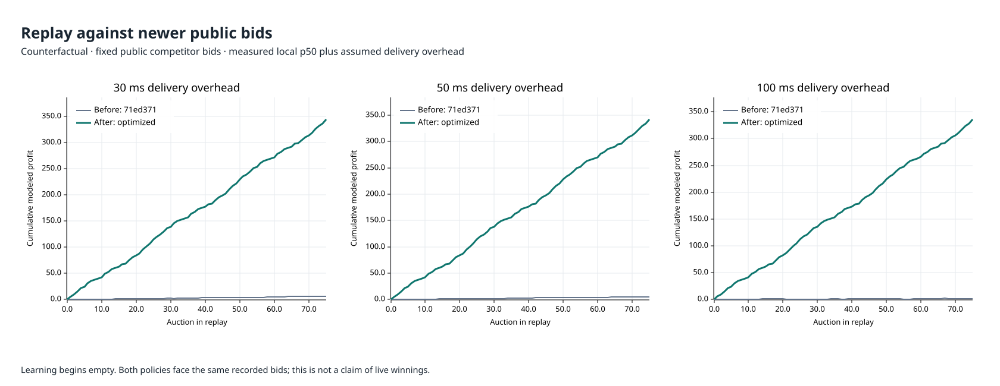
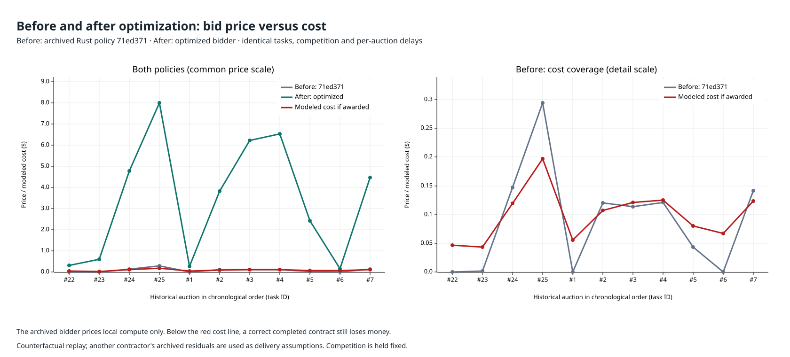
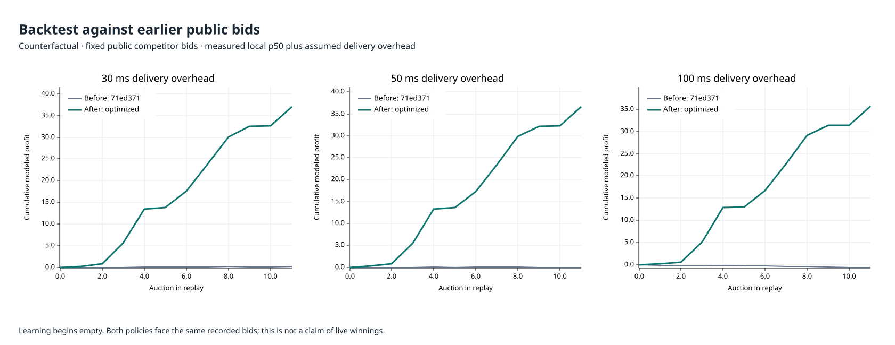
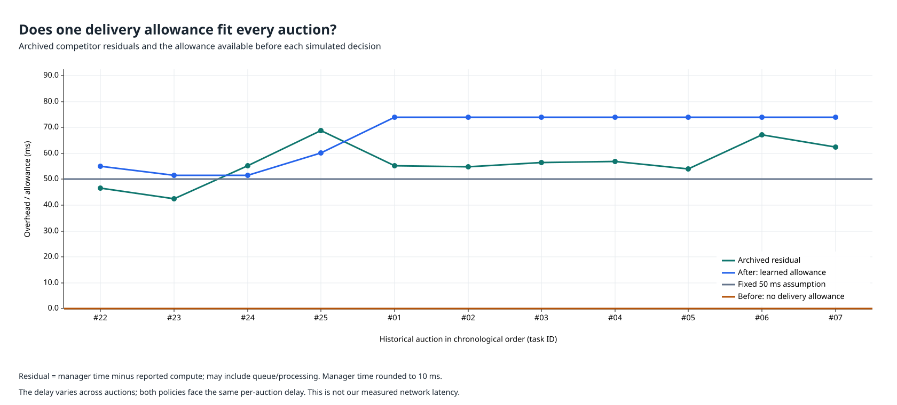
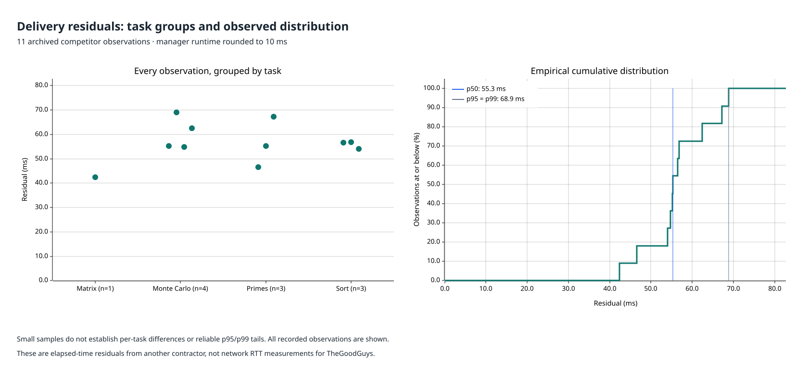
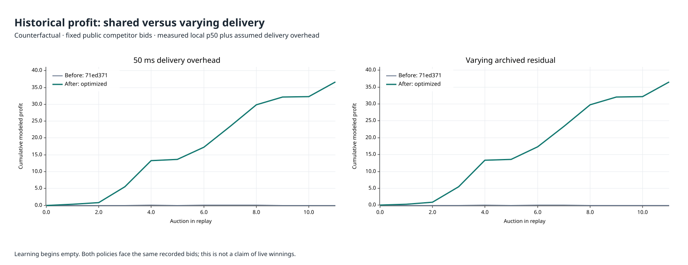

# Bidder evaluation

This is a **counterfactual replay**, not live tournament profit. It uses 25
captured public practice auctions repeated for three cycles, with competitor
bids held fixed. Each workload was executed in release Rust once for warmup
and five times for measurement; the measured local p50 is used for cost.
The adaptive policy starts with no learned observations and learns only after
its own simulated wins.



## Delivery-cost scenarios

The added 30, 50, and 100 ms are explicit assumptions, not measurements of this
client's network. The practice history shows manager runtimes exceeding local
compute times. Both policies face the same imposed overhead and actual
captured award configuration. Costs are `(local p50 + overhead) × cost_rate`;
late delivery is modeled with `late_credit` revenue and a budget-proportional
`penalty_rate` fine. Competition does not react to revised bids in this replay.

| Added delivery time | Old profit | New profit | Old/new wins | Old/new losing contracts |
|---|---:|---:|---:|---:|
| 30 ms | 6.6088 | 344.0142 | 75 / 75 | 33 / 0 |
| 50 ms | 5.1088 | 341.9408 | 75 / 75 | 42 / 0 |
| 100 ms | 1.3588 | 336.1498 | 75 / 75 | 57 / 0 |

## Before and after bidder optimization

**Before** executes the actual Rust `MyContractor::on_cfp` from
[`71ed371`](https://github.com/djsydney04/contract-net/blob/71ed37123263ce0dc859cbf3b870e3087843a0d5/src/strategy.rs),
the revision immediately before the bidder optimizations. Its complete strategy
source is frozen verbatim in
[`bidder-before-optimization.rs`](../../tests/fixtures/bidder-before-optimization.rs),
compiled into the replay tool, and checked against its pinned SHA-256 on every
run. It quotes `compute_seconds * cost_rate * 1.6`, includes queue time in its
completion estimate, and makes no allowance for delivery overhead.

**After** executes the current optimized Rust bidder with settlement learning,
delivery and compute reserves, and competition-aware pricing. Both receive
identical saved calibration, workloads, competitor bids, and per-auction delays.
This isolates bidding policy; it is not a comparison of the entire historical
application, old calibration noise, or Python versus Rust execution speed.
Old/new report columns mean these before/after policies throughout.



The left panel compares both policies on the same price scale. The right panel
uses a separate, explicitly labeled detail scale to show the old bid against
the modeled cost of executing that auction. A bid below the cost line loses
money if awarded. Points represent submitted quotes; a refusal has no point.
Costs remain counterfactual and use the archived delivery residual as a proxy,
as described below. Policy revision metadata accompanies both replay JSON files.

## Backtest on earlier history



11 complete older auctions were recovered from the earlier API trace. The
archived subset preserves proposals, awards, results, and original timestamps.
Because historical task parameters were not included in that trace, the replay
joins the later frozen task pool only when ID, type, budget, deadline, and the
old recorded result all match. Unmatched records are excluded. The fixture
documents this reconstruction; this is not a full historical tournament.
Each historical auction is replayed once, in chronological order, starting
with empty learning. No later outcome is used for an earlier decision.

| Added delivery time | Old profit | New profit | Old/new wins | Old/new losing contracts |
|---|---:|---:|---:|---:|
| 30 ms | 0.1878 | 37.0502 | 11 / 11 | 5 / 0 |
| 50 ms | -0.0322 | 36.6702 | 11 / 11 | 6 / 0 |
| 100 ms | -0.5822 | 35.6432 | 11 / 10 | 10 / 0 |

## Shared versus varying delivery overhead

A shared baseline is a useful starting estimate. An identical delay for every
auction hides variation. The current bidder pools overhead observations across
task types and uses their p95 plus 5 ms; before observations it allows 55 ms.
Compute and queue estimates remain separate.



The archived residual is `manager_seconds - local_seconds`. These 11 records
belong to the competitor named in the fixture, **not this client's network**.
They range from 42.4 to 68.9 ms. They can include queueing, processing, and
timing differences; the manager values were rounded to 10 ms. Treat them as
a proxy for a varying-overhead scenario, not measured network RTT. The blue
allowance uses only earlier simulated wins, before the current delay is known.



Across this subset, empirical p50/p95/p99 are 55.3/68.9/68.9 ms.
With 11 samples, upper percentiles can select the same maximum observation
and do not establish reliable tail latency. Per-task groups are smaller still.
Different group averages do not establish a task-type effect.



The varying replay uses each archived residual for its corresponding auction.
Both bidders receive the same realized delay for that auction. Each auction
is replayed once in chronological order with empty initial learning; the
current/future delay is never provided to the bidding decision. The fixed
50 ms comparison uses the same tasks, compute samples, and competitor bids.

| Overhead scenario | Old modeled profit | New modeled profit | Old/new wins | Old/new losing contracts |
|---|---:|---:|---:|---:|
| Fixed 50 ms | -0.0322 | 36.6702 | 11 / 11 | 6 / 0 |
| Varying archived residual | -0.1025 | 36.5346 | 11 / 11 | 7 / 0 |

All values remain counterfactual: inputs are reconstructed as described above,
competition is held fixed, and applying another contractor's overhead to our
client is an explicit assumption. The saved compute and decision timings are
reused unchanged; these new plots are not a fresh latency measurement.

[Individual residuals and prior forecasts](delivery-observations.csv) ·
[Replay outcomes and analysis source hashes](delivery-replay.json).

## Decision latency

Measured calls to the real `on_cfp` function, with 512 learned observations and
the captured public market snapshot. Each task has 25 warmups followed by
1,000 timed decisions. The table combines samples by task type and uses
nearest-rank percentiles. Units are **microseconds**. File I/O, networking,
queue handling, and task execution are excluded.

| Task | Decisions | p50 | p95 | p99 |
|---|---:|---:|---:|---:|
| `hash_search` | 5000 | 4.167 | 4.291 | 5.125 |
| `matmul_mod` | 5000 | 4.167 | 4.250 | 4.375 |
| `monte_carlo_pi` | 5000 | 3.917 | 4.000 | 4.125 |
| `prime_count` | 5000 | 4.000 | 4.125 | 4.250 |
| `sort_checksum` | 5000 | 3.875 | 4.000 | 4.125 |

Measured with `rustc 1.94.0 (4a4ef493e 2026-03-02)` on `macos aarch64; release; thin LTO; one codegen unit`. Raw decision samples use `std::time::Instant` in nanoseconds.

## Provenance and reproduction

- Capture: `wss://contractnet.blackdial.workers.dev/spectate?room=practice`, at 2026-09-09T01:40:43.644984+00:00.
- Base commit: `71ed37123263ce0dc859cbf3b870e3087843a0d5`; measurements completed 2026-09-09T02:19:56.885210+00:00. The measured working-tree
  sources are identified by per-file SHA-256 hashes in the raw data.
- [Captured auctions](../../tests/fixtures/practice-market.json).
- [Earlier historical subset and provenance](../../tests/fixtures/practice-history.json).
- [Raw timings, calibration, and source hashes](../../tests/benchmarks/results/bidder.json).
- [Every simulated outcome](replay.json).
- [Decision latency CSV](decision-latency.csv).

```bash
cargo run --locked --release --features benchmark-tools --bin bidder-replay
# Regenerate from the same saved timings:
cargo run --locked --release --features benchmark-tools --bin bidder-replay -- --render-only
```
